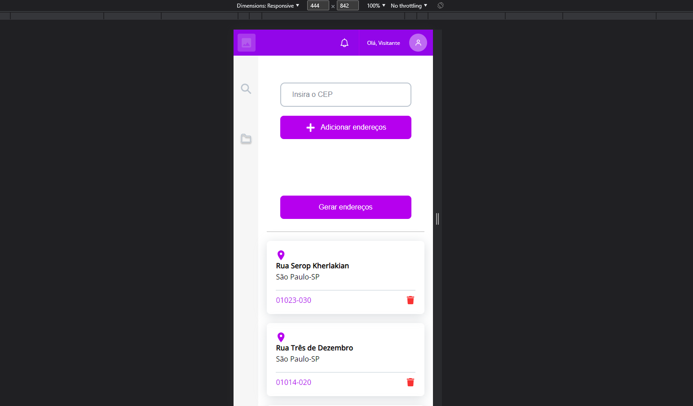

## **Tecnologias usadas no frontend**

- <a href="https://vuejs.org/">React</a>  
- <a href="https://axios-http.com/ptbr/docs/intro">Axios</a>  
- <a href="https://viacep.com.br/">Via CEP</a>   

## **Funções da aplicação**

Essa aplicação dá a possibilidade para que o usuário possa digitar um número válido de cep e ao clicar em "adicionar endereços",
retorne o valor e em seguida ao clicar em "gerar endereços", os dados possam ser  salvos no localstorage no browser e assim serem 
mostrados na tela. 

## **Como instalar em ambiente local**

- Na página desse projeto no Github clique em "Code", baixe o Zip ou copie o link do HTTPS.
- Abra um terminal em uma pasta de sua escolha e cole o link HTTPS.
- Certifique-se de ter instalado o Node em uma versão superior a 14.0.
- Após baixar o pojeto em um diretório de sua escolha abra o em um ternimal.  
- No diretório raiz digite  "npm install" e por fim, "npm run dev"
- A aplicação estará disponível no endereço "http://localhost:8080".
- Digite o endereço "http://localhost:8080" no browser para poder visualisá-lo.

## **Screenshots**

 